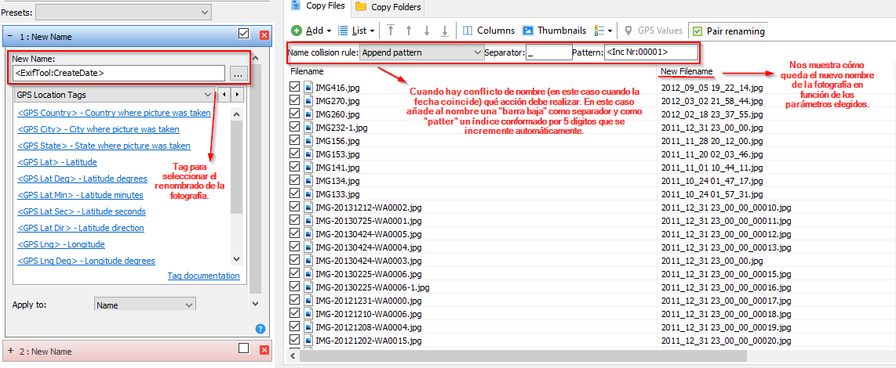
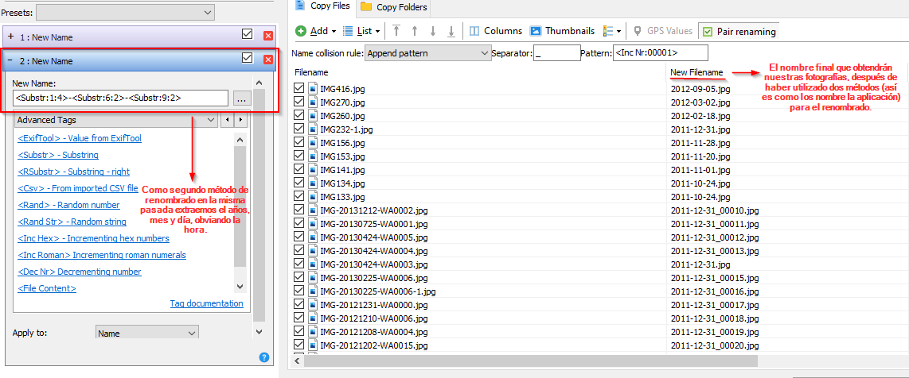
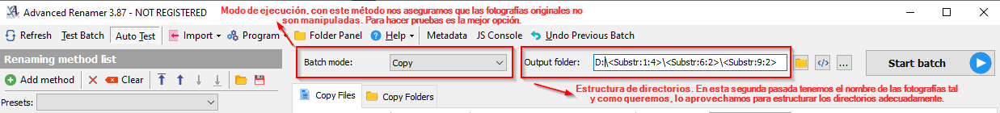

# Organizar biblioteca de fotos

Desde hace tiempo tengo anotada en mi lista "to-do" la **organización de mi biblioteca de fotos**. En esta tarea tenía varias notas apuntadas, entre ellas un [hilo de forocoches](https://www.forocoches.com/foro/showthread.php?t=6247364) de un usuario que había contado qué proceso llevaba a cabo para gestionar sus fotografías y algunas [piezas de software](https://www.hard2mano.com/topic/229786-recopilaci%C3%B3n-sobre-curiosidades-tecnol%C3%B3gicas-software-hardware-etc/?tab=comments#comment-1780140) como las que mencioné en [este hilo](https://www.hard2mano.com/topic/229786-recopilaci%C3%B3n-sobre-curiosidades-tecnol%C3%B3gicas-software-hardware-etc/) sobre curiosidades tecnológicas.

Antes de continuar voy a contar cuál es mi biblioteca de fotos, como la tengo "organizada" en estos momentos y qué pretendo conseguir.

### Biblioteca de fotos

Actualmente dispongo de apróximadamente **10.000 fotografías** (pueden **existir copias** de una misma fotografía) distribuidas del siguiente modo:

* 5.000 fotografías en mi **NAS** a las que tengo acceso desde cualquier dispositivo que sea capaz de conectarse a recursos compartidos a través del protocolos [smb](https://www.hard2mano.com/topic/229786-recopilaci%C3%B3n-sobre-curiosidades-tecnol%C3%B3gicas-software-hardware-etc/).
* 5.000 fotografías en mi **teléfono móvil** (iOS) con copias de seguridad habituales a través de iTunes (un coñazo, esto no puede continuar así xD).

Además dispongo de un disco duro dañado físicamente (un mal golpe) con multituid de fotografías de las cuales no había copias de seguridad (sí, hubo una época en la que no era consciente del riesgo que supone no disponer de una estrategia de backup, ni tampoco poseía los mismos conocimientos que poseo ahora). Este disco duro lo tengo guardado desde hace varios años con la esperanza de que los precios disminuyan y pueda recuperar todos los datos que se encuentran en este HDD.

### Organización de las fotografías

Las fotografías (no todas) que tengo almacenadas en el NAS tienen una estructura similar a esta:
````
/fotos
├── familia
│   ├── nocheVieja_2018
│   │   ├── nocheVieja_2018_001.png
│   │   ├── nocheVieja_2018_002.png	
│   ├── semanaSanta_2019
│   │   ├── semanaSanta_2019_001.png
│   │   └── ...
│   └── ...
├── amigos
│   ├── viajeEuropa_2017
│   │   ├── viajeEuropa_2017_001.png
│   │   └── ...
│   └── ...
└── ...
````

Aunque en un principio me parecía que era una estructura sencilla de mantener, no lo está siendo. Si no se generan muchas fotografías o no se acumulan gran cantidad de ellas para gestionar, puede no ser muy laborioso, pero habitualmente dispongo de una gran cantidad de fotos que tengo que revisar de una en una para renombrarlas adecuadamente.


### ¿Qué pretendo conseguir?


Intentar automatizar la mayor parte de la organización de mi biblioteca de fotos. Para ello durante este fin de semana he estado probando algunas herramientas que facilitarían todo este proceso.

* **Eliminar duplicados**: en el hilo de Forocoches recomendaban [Image Comparator](https://sourceforge.net/projects/imagecomparator/), pero después de probar esta y [dupeGuru](https://dupeguru.voltaicideas.net/) me quedo con esta última. La razón principal es por una mayor eficacia a la hora de encontrar fotos duplicadas. Además dispone de [imagen para Docker](https://github.com/jlesage/docker-dupeguru), muy útil por ejemplo para gestionar los duplicados de aquellas fotografías que están en un NAS y no se comparten a través de la red.

* **Renombrado y organización en carpetas**: en la red podemos encontrar varias herramientas de renombrado masivo de ficheros, pero no hay tantas para el renombrado de imágenes que aprovechan los metadatos de estas para elaborar el nombre del fichero. La herramienta que mencionaban en el hilo de Forocoches es **Picmv**, la web oficial parece que ya no está disponible y además no he encontrado ningún lugar desde donde descargarla de forma segura. Por este motivo he estado probando [Advanced Renamer](https://www.advancedrenamer.com/). Algunos aspectos que me parecen interesantes destacar:
	* Multitud de [tags](https://www.advancedrenamer.com/user_guide/tags) para elaborar el nombre del fichero. Tags como **date**, **substr**, **dirname**, **gpslocation**, etc.
	* En caso de que durante el renombrado haya algunos ficheros que se les vaya a asignar el mismo nombre dispone de varias [reglas](https://www.advancedrenamer.com/user_guide/name_collision_rules) como **añadir un número** al final del nombre, **no** modificar el fichero, etc.
	* [Acción](https://www.advancedrenamer.com/user_guide/batchmode) (**batch mode**) a ejecutar sobre los ficheros, que puede ser el renombrado en el mismo directorio, mover a otro directorio diferente o copiar y mantener los originales. Además a la hora de seleccionar el destino, también podemos utilizar los **tags** para elaborar el nombre del directorio.
	* Incorpora [ExifTool](https://exiftool.org/) para extraer los metadatos de las fotografías.

* **Gestión automatizada de las fotografías del smartphone**: como comentaba más arriba, utilizo un dispositivo con iOS y la única alternativa que encaja con la gestión automatizada es la aplicación [PhotoSync](https://www.photosync-app.com/home.html) (tiene versión gratuita, pero en mi caso no es suficiente ya que al realizar la transferencias las comprime). Algunas de las características que cabe destacar:
	* Renombrado automático, permitiendo adaptarse al renombrado que utilizaré con la aplicación Advanced Renamer para el renombrado de las fotografías que ya se encuentran en el NAS y para aquellas que haga con otro dispositivo que no sea el iPhone (no es habitual).
	* Eliminación automática de las fotografías una vez finalizada la transferencia.
	* Creación automática de directorios. Como aún no he probado la aplicación no sé si tendrá un comportamiento adecuada. Es decir, si es capaz de saltarse el proceso de creación sin errores cuando en el destino el directorio ya existe.

Teniendo en cuenta todo lo anterior, el árbol de directorios debería quedar algo así:
````
/fotos
├── 2018
│   ├── 12
│   │   ├── 31
│   │   │   ├── 2018_12_31_001.png	
│   │   │   ├── 2019_04_22_002.png
│   │   │   └── ...
│   │   └── ...
│   └── ...
├── 2019
│   ├── 04
│   │   ├── 22
│   │   │   ├── 2019_04_22_001.png
│   │   │   ├── 2019_04_22_002.png
│   │   │   └── ...
│   │   ├── 23
│   │   └── ...
│   ├── 07
│   │   ├── 24
│   │   │   ├── 2019_04_22_001.png
│   │   │   └── ...
│   │   └── ...
│   └── ...
└── ...
````

Evidentemente esta estructura de directorios se genera de forma automática (los **tags** son los que facilitan este proceso) y a mí personalmente me parece una forma más adecuada para organizar toda una biblioteca de fotos. Disponemos de **directorio por año**, **directorio por mes**, **directorio por día** y en este útlimo directorio se guardaran las fotografías con el nombre **AAAA_MM_DD_XXX.png**.

El único inconveniente es que no hay ninguna identificación sobre el evento al que pertenecen. Por el momento no me improta demasiado, pero si quisiese añadir algo más a las fotografías podría realizar una segunda pasada, manteniendo el nombre original, Advanced Renamer me permitiría añadir texto adicional que identificase el evento de ese día.


Cuando digo que no me importa es debido a que mi intención es implementar una herramienta del estilo **Google Fotos** pero [self-hosted](https://www.hard2mano.com/topic/230644-servicios-self-hosted-en-un-vps/) en mi NAS. Aunque aún no la he puesto en marcha mis expectativas son:

* Mantener la estrucutra de directorios, es decir que "beba" de las fotografías almacenadas en el NAS pero que no las manipule.
* Filtrado por reconocimiento de caras.
* Geolocalización de fotografías (dependerá de si hay información en los metadatos).
* Si no es capaz de identificar los eventos (no lo he mirado, supongo que esto de momento no hay forma de hacerlo), poder "etiquetar" desde la interfaz las imágenes en función del evento al que perteneces.

Creo que no me dejo nada, ahora es vuestro turno...

* ¿Qué proceso seguís para organizar vuestras bibliotecas de fotos?
* ¿Alguna recomendación sobre lo expuesto?

**Edit**

Hoy me he topado con un software muy potente, que simplemente lo he instalado para ver qué funcionalidades tiene. Hay que estudiarlo un poco para conocer toda su capacidad, tiene bastantes opciones que creo que pueden ser interesantes para poder añadir información y trabajar con multitud de imágenes.

El software en cuestión es [XnView MP](https://www.xnview.com/en/xnviewmp/) de la compañía **XnSoft**. Disponen de varios productos de software, pero este que he mencionado incluye varios de estos productos de software.


### Actualización

Ha pasado casi un mes desde que abrí el hilo, pero hasta hoy no he llevado la tediosa tarea de organizar adecuadamente toda la biblioteca de fotos (aún no he terminado). Lo que publiqué en el primer mensaje de este hilo simplemente era información que había ido recopilando de diferentes herramientas que podría utilizar y cómo iba a llevar a cabo el trabajo.


Como decía, hoy me he puesto con el grueso de la tarea y quería dejar algún apunte adicional que podría ser interesante.

* Al directorio contenedor de todas las fotografías le he añadido un fichero **README.txt**. Este fichero contiene información sobre cómo he estructurado todas las fotografías y las herramientas utilizadas. Además, también he añadido información sobre cómo he elaborado el nombre de las diferentes fotografías (si alguno está interesado lo puedo enlazar).
* La herramienta que he utilizado para el renombrado masivo ha sido Advanced Renamer (mencionada en el primer mensaje), aplicación disponible para Windows 10. Para el correcto renombrado y organización de todas las fotografías he necesitado realizar dos "pasadas" que explicaré a continación.
	1. Esta herramienta hace uso de **tags** para elaborar el nuevo nombre de las fotografías. En mi caso el nombre de las fotografías se basará en la fecha de captura, tal que **año-mes-día_número.ext** (número se incrementa automáticamente cuando hay más de una fotografía correspondiente a la misma fecha). El tag que siempre devuelve la fecha de captura de la fotografía, nos devuelve la fecha completa con lo cual no nos sirve para crear directorio de año, directorio de mes y directorio de día (al menos yo no he conseguido hacerlo). Existe otro tag que extrae la fecha de creación del fichero de la fotografía (que no siempre coincide con la fecha que hay en los metadatos) y que si permite extraer la fecha de forma indpenediente y de ese modo elaborar simultaneamente la estructura de los directorios (**año/mes/día/fotografía.jpg**).
	2. En la segunda pasada no renombraremos las fotografías, simplemente las moveremos (una vez que estamos seguros que el proceso va a funcionar, podemos utilizar este **batch mode**) a los directorios correspondientes para cumplir con la estructura que hayamos definido. Creo que la mejor forma de verlo es con varias fotografías, que irán en orden explicando el proceso que he seguido.

#### Paso 1:



#### Paso 2:



#### Paso 3:



* No sé si os habéis fijado, pero en el recuadro que hace referencia al "**name collision rule**" del primer paso, he utilizado un patter específico. Una de las opciones que muestra el desplegable es "**Append number**" que automáticamente añade un índice que se va incrementando con cada fotografía. El inconveniente de este índice es que no se puede seleccionar el número de dígitos que se van a mostrar, y en este caso añade un total de 3 dígitos. La aplicación que voy a utilizar para subir las fotografías del teléfono móvil (**Photosync**) y que además las renombrará y organizará tal y como lo tengo establecido en el README.txt, muestra un total de 5 de digitos cuando hay un "name collision". Por una cuestión de "limpieza" he seleccionado el "**Append pattern**" ya que utilizando el tag "**\<Inc Nr:00001\>**" puedo hacer coincidir el número de digitios con el número que establece la aplicación Photosync.

Por último, he estado [investigando](https://exiftool.org/forum/index.php/topic,5168.msg24906.html#msg24906) sobre el "**reverse geotagging**", aunque no he llegado a mucho más porque a falta de probar algunas de los servicios self-hosted, creo que cogerá correctamente la información de GPS almacenada en los metadatos.